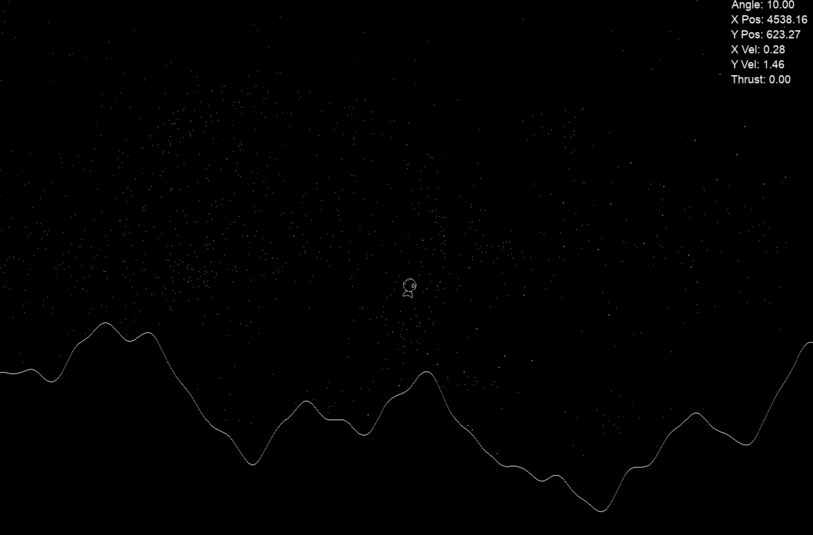

# LunarLander

Lunar Lander clone in C++ and SDL2. <kbd>Space</kbd> to thrust, <kbd>←</kbd> <kbd>→</kbd> to steer the ship, <kbd>R</kbd> to restart.

- **Reusable C++17 engine architecture.** `engine_lib` (RAII window, renderer, texture/font wrappers, timers, 2D vector math) + `lunar_lander_lib` for game logic. Memory is managed via `std::unique_ptr` with custom SDL deleters.

- **Vector-based physics.** Position, velocity, acceleration, thrust and gravity are all fully simulated physics `Vector2D` quantities. Holding thrust adds a *unit of jerk* (the time-derivative of acceleration) per frame, giving the controls a feeling of inertia.

- **Procedural generation using Perlin noise.** Perlin noise is used to generate the cratered terrain foreground and the parallax scrolling background starfield.

- **Texture rendering optimisation.** Both the terrain and the starfield are procedurally generated and then rendered **once** into hardware textures and blitted as a single texture per frame - no per-pixel work in the game loop. This sped the game up by over 20×.

- **World/viewport camera system.** The world is 10× wider (configurable) than the screen and the camera follows the player, clamping at world edges, providing a sense of scale.

- **Headless-testable game logic.** GoogleTest suite covers vector math and collision physics. Collision logic is decoupled from SDL via a mock `Texture`, so tests run without a renderer.

*Fully parameterised — tweak [`Constants.h`](include/lunar_lander/Constants.h) for heavier gravity, rougher terrain, a busier galaxy, a wider world.*